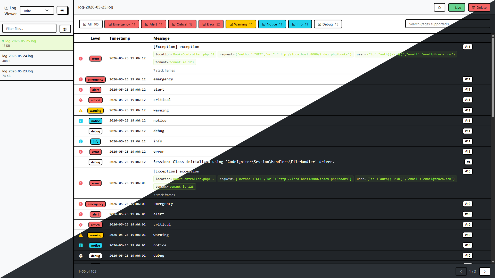
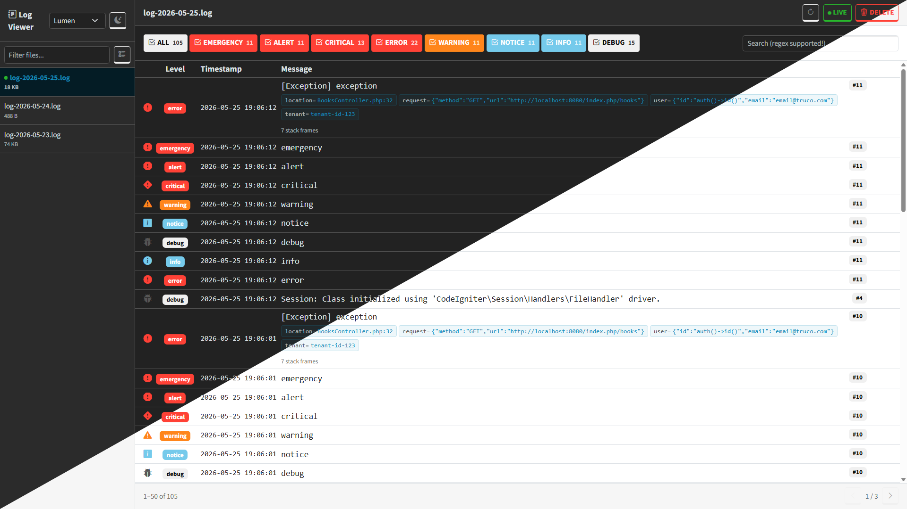
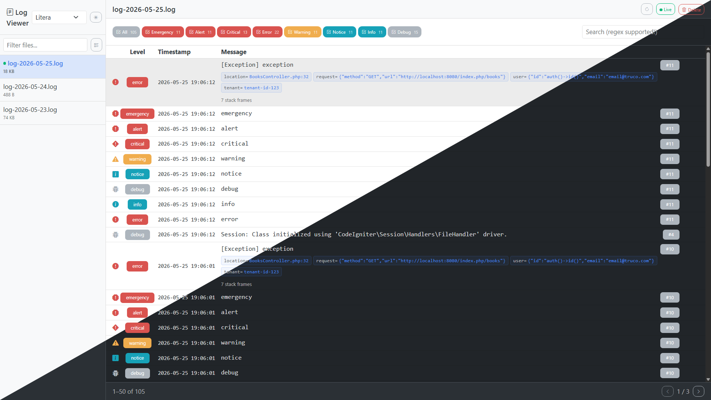
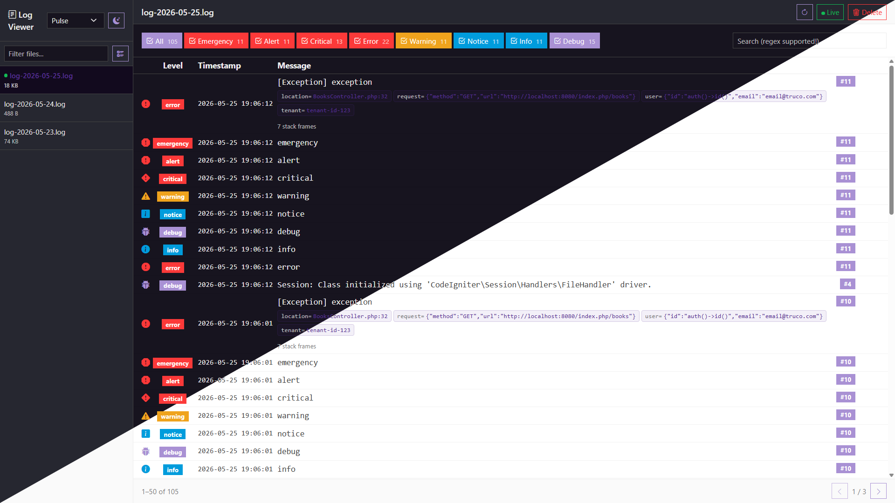

# ci4-logging-extended

Extended logging for CodeIgniter 4 — part of the [`ci4-*-extended`](https://github.com/brunoggdev) series.

Three things in one package:

1. **Context serialization** — CI4's native logger silently discards context keys that have no matching `{placeholder}`. The extended logger appends them automatically as structured `key=value` pairs.
2. **`exception()` method** — Log a `Throwable` with rich, structured context: location, request, user identity, session, stack trace — all configurable and extensible.
3. **Log Viewer** — A clean web UI for browsing, filtering, and searching your daily log files, with deep links straight to your IDE.

---

## Installation

```bash
composer require brunoggdev/ci4-logging-extended
```

That's it. The package auto-registers the extended logger via its `Services` config — every `log_message()` and `logger()->*()` call in your app will use it automatically.

To customize behavior (Log Viewer gate, exception context, deep links), publish the config:

```bash
php spark logging-extended:publish
```

---

## Context serialization

PSR-3 only interpolates context keys that have a matching `{placeholder}` in the message — everything else is discarded by design. With the extended logger, leftover keys are appended automatically:

```php
// Native CI4 — context is silently discarded, log only shows "copyProducts failed"
log_message('error', 'copyProducts failed', [
    'source' => $sourceId,
    'target' => $targetId,
    'error'  => $e->getMessage(),
]);
```

With the extended logger:

```
ERROR - 2026-03-20 14:32:01 --> copyProducts failed | source=42 target=99 error="Division by zero"
```

PSR-3 placeholder interpolation still works — keys consumed by `{placeholders}` are not duplicated in the appended context:

```php
logger()->warning('Retry {job} on attempt {attempt}', [
    'job'     => 'SendEmail',   // consumed by {job}
    'attempt' => 3,             // consumed by {attempt}
    'reason'  => 'timeout',    // not a placeholder — appended
]);
// WARNING - ... --> Retry SendEmail on attempt 3 | reason=timeout
```

### Value formatting

| PHP type | Log format |
|---|---|
| `null` | `key=null` |
| `true` / `false` | `key=true` / `key=false` |
| String without spaces | `key=value` |
| String with spaces | `key="value with spaces"` |
| Array / object | `key={"json":"encoded"}` |

---

## `exception()` method

Log a `Throwable` with a single call:

```php
try {
    // ...
} catch (Throwable $e) {
    logger()->exception($e);              // defaults to 'error' level
    logger()->exception($e, 'warning');   // any PSR-3 level
    logger()->exception($e, 'error', 'Failed to process order #' . $orderId); // custom message
}
```

Default output (with `trace: false` for brevity):

```
ERROR - 2026-03-20 14:32:01 --> [RuntimeException] Something went wrong | message="Something went wrong" location=/var/www/app/Services/OrderService.php:84
```

With a custom message, the exception's own message is omitted from context — the call-site message is the log entry:

```
ERROR - 2026-03-20 14:32:01 --> [RuntimeException] Failed to process order #99 | location=/var/www/app/Services/OrderService.php:84
```

### Configuration

Publish the config (`php spark logging-extended:publish`) and edit `app/Config/LoggingExtended.php`:

```php
public array $exception = [
    'trace'   => true,      // include full stack trace
    'request' => true,      // log method + URL
    'params'  => false,     // GET/POST/JSON body — off by default (privacy)
    'headers' => false,     // request headers — off by default (may expose tokens)
    'redact'  => [          // keys redacted from params and headers (case-insensitive, recursive)
        'password', 'token', 'api_key', 'authorization', 'credit_card', ...
    ],
    'user'    => null,      // callable returning user data
    'session' => false,     // true = all session data; callable for filtered keys
    'context' => [],        // ['label' => callable] for custom context
];
```

Set your values in the constructor **before** calling `parent::__construct()`:

```php
public function __construct()
{
    $this->exception['user']    = fn () => ['id' => auth()->id(), 'email' => auth()->user()?->email];
    $this->exception['context'] = ['tenant' => fn () => session('tenant_id')];

    parent::__construct(); // applies defaults and validates — keep at the bottom
}
```

#### Rich exception context example

With `user`, `request`, `context`, and `trace` enabled, a single `exception()` call produces:

```
ERROR - 2026-03-20 14:32:01 --> [RuntimeException] Something went wrong | message="Something went wrong" location=/var/www/app/Services/OrderService.php:84 request={"method":"POST","url":"https://app.test/checkout"} user={"id":7,"email":"alice@example.com"} tenant=acme-corp
#0 /var/www/app/Controllers/CheckoutController.php(42): OrderService->process()
#1 /var/www/vendor/codeigniter4/framework/system/Router/Router.php(563): ...
...
```

Every structured key is searchable in the Log Viewer using dot-notation: `user.email=alice@example.com`, `request.method=POST`, `tenant=acme-corp`.

### Extending with external trackers

Override `exception()` in a subclass and call `parent::` to keep the file log entry:

```php
use Brunoggdev\LoggingExtended\Logger;

class SentryLogger extends Logger
{
    public function exception(Throwable $e, string $level = 'error', ?string $message = null): void
    {
        \Sentry\captureException($e);
        parent::exception($e, $level, $message);
    }
}
```

Wire your subclass in `app/Config/Services.php` instead of the base logger. The `buildExceptionContext()` method is also `protected` — override it to add fields without replacing the whole method.

---

## Log Viewer

A web UI for browsing your daily log files, with multiple themes to choose from and light/dark mode:






### Features

- **Browse** daily log files with pagination and level breakdowns
- **Filter by level** — click any level badge to narrow entries
- **Search** — full-text, dot-notation context lookup, and regex (see [Filtering and search](#filtering-and-search))
- **Shareable links** — search query, level filter, file, and page are all reflected in the URL
- **Live tail** — new entries stream in automatically while viewing today's file (via SSE)
- **File management** — delete individual files or bulk-select and delete multiple at once
- **IDE deep links** — click any stack frame to jump straight to that file and line in your editor
- **Occurrence tracking** — repeated messages show `2/5` to surface noise without losing context

### Setup

The viewer is enabled by default on developmentin your published config. Set the `gate` to control who can access it:

```php
$this->viewer['gate'] = fn () => auth()->loggedIn() && auth()->user()->isAdmin();
```

By default the gate allows access only in the `development` environment and denies (404) everywhere else.

### Accessing the viewer

The viewer mounts at `/logs` by default. Change `routesPath` to move it:

```php
public array $viewer = [
    'routesPath' => 'devtools/logs',
    // ...
];
```

### Filtering and search

The search box supports:

| Query | Matches |
|---|---|
| `payment failed` | entries containing both words (AND logic) |
| `user.email=alice@example.com` | dot-notation equality |
| `request.method=POST` | dot-notation equality |
| `user.email=.*@example\.com` | dot-notation with regex |
| `user.id` | dot-notation presence check (key exists) |

Multiple space-separated terms all must match (AND, not OR).

### IDE deep links

Stack frame file paths in the viewer link directly to your IDE. Configure the `deeplink` section:

```php
'deeplink' => [
    'ide'        => 'vscode',      // 'vscode', 'phpstorm', or null to disable
    'wslDistro'  => 'Ubuntu',      // WSL distro name, or null if not on WSL
    'serverPath' => '/var/www/app/',         // path prefix as it appears in the logs
    'localPath'  => '/home/user/projects/app/', // your local equivalent
],
```

When `serverPath` and `localPath` are both set, links are rewritten from the server path to your local path. This covers Docker, VM, and WSL setups where file paths in logs differ from your local filesystem.

Tip: use `env()` for any of these if your team has mixed environments (WSL / native Linux / Mac):

```php
'wslDistro' => env('WSL_DISTRO_NAME'),
'localPath'  => env('LOG_LOCAL_PATH', '/home/user/projects/app/'),
```

### Viewer configuration reference

```php
public array $viewer = [
    'enabled'    => true,       // false = completely hide the viewer and its routes
    'routesPath' => 'logs',     // URL path where the viewer is accessible
    'gate'       => null,       // callable returning bool; null = deny (404). Defaults to development-only.
    'deeplink'   => [
        'ide'        => 'vscode',   // 'vscode', 'phpstorm', or null
        'wslDistro'  => null,       // WSL distro name (VSCode only)
        'serverPath' => null,       // server-side path prefix to rewrite
        'localPath'  => null,       // local path equivalent
    ],
    'perPage'    => 50,         // entries per page
];
```

---

## `log:tail`

Watch your log file live in the terminal:

```bash
php spark log:tail
```

Shows the last 20 lines on startup, then streams new entries as they arrive. Rolls over automatically at midnight.

### Options

| Option | Description | Default |
|---|---|---|
| `-level` | Filter by log level | — |
| `-filter` | Filter lines containing this text (case-insensitive) | — |
| `-lines` | Lines to show on startup (`0` to skip history) | `20` |

### Examples

```bash
php spark log:tail                                        # watch everything
php spark log:tail -level error -lines 0                 # errors only, no history
php spark log:tail -filter payment -lines 100            # keyword filter, last 100 lines
php spark log:tail -level warning -filter checkout       # combine both filters
```

### Output

```
  ERROR      2026-03-20 14:32:01  copyProducts failed | source=42 error="Timeout"
  WARNING    2026-03-20 14:32:05  Retry scheduled | job=CopyProducts attempt=2
  INFO       2026-03-20 14:32:10  Job completed successfully
```

Level labels are colorized: red for `error`/`critical`/`alert`/`emergency`, yellow for `warning`, cyan for `notice`, green for `info`, gray for `debug`. The context block (after `|`) is highlighted in cyan.

---

## Related packages

- [brunoggdev/ci4-events-extended](https://github.com/brunoggdev/ci4-events-extended)
